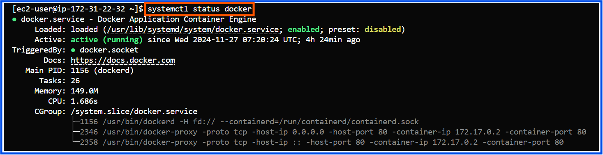
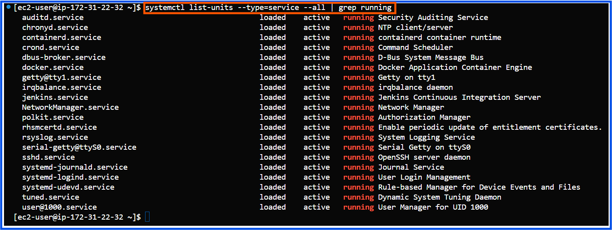

# Core Linux Administration Tasks

## Process and System Monitoring
**Tasks:**
1) Monitor running processes using **ps, top, htop, and pidstat**.
2) Manage processes **(kill, pkill, nice, renice, systemctl)**.
3) Check system performance metrics such as CPU, memory, and disk I/O using **vmstat, iostat, sar and free**.
4) Monitor log files using **tail, head, less, and journalctl**.
---
### 1. Monitor Running Processes:
Tools like ps, top, htop, and pidstat help you inspect and monitor processes.

**Example:**

- **1.1) View running processes related to Jenkins:**
  ```bash
  ps aux | grep jenkins
  ```
  This shows all processes related to Jenkins, along with their PID and memory usage.

  

- **1.2) Inspect system-wide process details: top**
  ```bash
  top
  ```
  Provides a live view of system processes, along with CPU and memory usage statistics.

  

- **1.3) Use htop for interactive process management: htop**
  ```bash
  htop
  ```
  - Navigate the process list using arrow keys.
  - Search for Jenkins or Docker processes by pressing / and typing "jenkins", "sshd" or "docker".

  

  **Ex: Serch for sshd service:**
  
  

- **1.4) Check detailed stats of a specific process: pidstat**
  ```bash
  pidstat -p <PID>
  ```
   Replace <PID> with the process ID of Jenkins or Docker to see CPU and memory usage.
  
  **Note:**
  The pidstat command is included in the sysstat package, which might not come pre-installed on your EC2 instance.
  You can install it by following these steps:
  
  - **Amazon Linux / Amazon Linux 2 / RHEL / CentOS:**
  ```bash
  sudo yum install sysstat -y
  ```
  **pidstat-jenkins-example:**
   

  **pidstat-docker-example:**
   
  
---

### 2) Manage processes (kill, pkill, nice, renice, systemctl) 
- **2.1) kill:**
  - **Purpose:** The kill command in Linux is utilized to stop processes by sending designated signals to their process IDs (PIDs).
  - **How kill Works:**
    - Processes in Linux listen for signals sent to their PIDs.
    - The kill command sends a signal (default is TERM) to the target process.
    - The process can handle the signal (if programmed to do so) or terminate.
  - **Syntax:**
  ```bash
  kill [options] <PID>
  ```
  
    ## Common Signals

    | Signal | Name      | Description                                                |
    |--------|-----------|------------------------------------------------------------|
    | 1      | `SIGHUP`  | Reloads the process configuration without stopping it.     |
    | 9      | `SIGKILL` | Forcefully kills the process. Cannot be caught or ignored. |
    | 15     | `SIGTERM` | Gracefully terminates the process (default signal).        |
    | 19     | `SIGSTOP` | Pauses the process.                                        |
    | 18     | `SIGCONT` | Resumes a paused process.                                  |

    
   
  
  - Reload Process Configuration
    -Use SIGHUP to reload a process’s configuration without stopping it:
  ```bash
  kill -1 <PID>
  ```
  
  

  **Alternatives to kill:**
  
 - **killall:** Terminates processes by name:
  ```bash
  killall apache2
  ```
 - **pkill:** Sends signals to processes by name, user, or other criteria:
  ```bash
  pkill -u <username> <process_name>
  ```
 - **xkill:** Graphically kill a window on desktop environments.

- **2.2) nice ,renice:**
  - **Purpose:** Nice and renice are commands used to modify the priority of a process, influencing the amount of CPU time it receives in relation to other processes.
- **2.2.1) nice:**
    Used to start a new process with a specified niceness value (priority level).
  ```bash
  nice -n <niceness_value> <command>
  ```
  - <niceness_value>: A number between -20 (highest priority) and 19 (lowest priority). The default is 0.
  
  - Lower niceness = higher priority.
    
  **Example:**
  ```bash
  nice -n 10 python script.py
  ```
  - Starts the process python script.py with a lower priority (niceness value 10).
 
- **2.2.2) renice:**
    Used to change the priority of an already running process.
  ```bash
  renice <niceness_value> -p <PID>
  ```
  - <niceness_value>: The new priority value.
  
  - <PID>: Process ID of the target process.
    
  **Example:**
  ```bash
  renice 5 -p 1234
  ```
  - It changes the priority of the process with PID 1234 to 5
 
- **2.3) systemctl:**
  - **Purpose:** The systemctl command is utilized for managing systemd services, which are responsible for starting, stopping, and overseeing various services                    and processes.
  - **Syntax:**
    
  ```bash
  systemctl [OPTIONS] COMMAND [SERVICE_NAME]
  ```
  
  - OPTIONS: Additional flags for controlling how the command runs (e.g., --quiet or --no-block).
  - COMMAND: The action to perform on the service (e.g., start, stop, restart, etc.).
  - SERVICE_NAME: The name of the service or unit to manage (e.g., docker, jenkins, kubelet).

## Systemctl Command Examples

### Start a Service

To start a service using the `systemctl` command:
```bash
sudo systemctl start docker
```

### Stop a Service

To stop a service using the systemctl command:
```bash
sudo systemctl stop docker
```

### Restart a Service

To restart a service using the systemctl command:
```bash
sudo systemctl restart docker
sudo systemctl restart jenkins
```

### Check the Status of a Service
To check the status of a service:

```bash
systemctl status docker
systemctl status kubelet
```

### Enable a Service to Start at Boot
To enable a service to start automatically at boot:

```bash
sudo systemctl enable docker
sudo systemctl enable jenkins
```

### Disable a Service from Starting at Boot
To prevent a service from starting automatically at boot:

```bash
sudo systemctl disable docker
```

### Reload Configuration Without Restarting
To reload the configuration of a service without restarting it:

```bash
sudo systemctl reload nginx
sudo systemctl reload apache2
```

### View All Running Services
To view all running services on the system:

```bash
systemctl list-units --type=service
systemctl list-units --state=running
```

### Additional Examples
List Services by Specific States

```bash
systemctl list-units --type=service --state=failed
systemctl list-units --type=service --state=inactive
```

### Check System Logs for a Service
```bash
journalctl -u docker.service
journalctl -u nginx.service
```






---
 
### 3) Check system performance metrics such as CPU, memory, and disk I/O using vmstat, iostat, sar and free.

- **3.1) vmstat (Virtual Memory Statistics):**
    - Purpose: Displays a snapshot of system performance, including CPU, memory, and I/O usage. Ideal for identifying bottlenecks.
      - Key Metrics:
        - CPU: us (user), sy (system), id (idle), wa (waiting for I/O).
        - Memory: free, buff, cache.
        - Disk I/O: bi (blocks in), bo (blocks out)
  **Example Use Cases:**
        - Monitor system performance in real time (every second for 5 intervals):
  ```bash
  vmstat 1 5
  ```
  **Output Example:**

  

  - r: Number of processes waiting to run (high r = CPU bottleneck).
  - wa: High values indicate I/O bottlenecks (e.g., slow disk or network)
- To detect high I/O wait during Jenkins builds, execute vmstat while a Jenkins job is running. If the 'wa' value is elevated, look into the performance of the disk or the activity of Docker containers.

- **3.2) iostat (Input/Output Statistics):**
    - **Purpose:** This tool provides insights into CPU usage and the I/O performance of storage devices and partitions.
        - **Key Metrics:**
          - **%iowait:** The percentage of CPU time spent waiting for I/O operations to finish. Elevated values suggest possible disk or network bottlenecks.
          - **r/s, w/s:** The number of read and write requests per second, showing the intensity of disk activity.
          - **rkB/s, wkB/s:** Kilobytes read and written per second, indicating the data transfer rate.
          - **%util:** The percentage of time the disk was busy. Values nearing 100% indicate the disk is a bottleneck.

  **Example Use Cases:**
  - **Monitor disk I/O in real time (update every second):**
  ```bash
  iostat -dx 1
  ```
   **Output Example:**

  

**How to Use iostat for Docker/EKS Applications?**

  **Practical Example for Docker:**
  
  **Scenario:** A container running a MySQL database is slow.
  
  **1. Run iostat:**
  ```bash
  iostat -dx 1
  ```
  - If %util is consistently above 90% or w_await is high, the disk is overloaded or slow.
  **2. Identify the container causing high disk usage:**
    
  ```bash
  docker stats
  ```
 - Look for the MySQL container's IO metrics.
  - docker stat command output example:
    
     
    

  **3. Solution:**
  - Move the database files to a faster storage backend (e.g., AWS EBS gp3 or io2 volumes).
  - Optimize database queries or reduce IOPS requirements.

 **Check Kubernetes Storage Usage:**

  For EKS, check the Kubernetes storage backends:
  
    - If the application is utilizing AWS EBS volumes, keep an eye on the performance of the attached volume:
    
        - Use AWS CloudWatch Metrics (e.g., VolumeReadOps, VolumeWriteOps) to monitor EBS volume usage.
        
        - Alternatively, on the EKS node, use iostat to check the performance of the /dev/xvda or /dev/nvme* devices.

- **3.3) sar (System Activity Reporter):**
    **Purpose:**
    - The sar command is used to collect, report, and save metrics related to system performance, such as CPU, memory, disk, and network usage. It is 
      particularly helpful for analyzing real-time system activity as well as historical trends from logs that were collected earlier.
    - **Key Metrics Tracked:**
        - **CPU usage:** %user, %system, %iowait, %idle, etc.
        - **Disk I/O:** Transfer rates, wait times, and device utilization.
        - **Memory usage:** Free and used memory, swap activity.
        - **Network usage:** Packet transfer rates and errors over time.
    - **Usage:**
        - **Real-Time CPU Usage:**
    ```bash
    sar -u 5 3
    ```
  - Captures CPU usage in real time every 5 seconds for 3 iterations.
     
    
  
   - Here’s a complete guide for using the sar command to monitor system activity, which includes enabling necessary components and troubleshooting steps:

   **Step 1: Install Sysstat**
  
  i) Install the package:
  
    ```bash
    sudo yum install sysstat -y
    ```
  ii) Verify the installation:
  
    ```bash
    sar -V
    ```
  
  **Step 2: Enable and Start the Sysstat Service**
  
  i) Enable the service:
    ```bash
    sudo systemctl enable sysstat
    ```
  ii) Start the service:
    ```bash
    sudo systemctl enable sysstat
    ```
  iii) Verify the service is running:
    ```bash
    sudo systemctl status sysstat
    ```

  
  

  **Step 3: Configure Data Collection**

  The sar command depends on regular data collection performed by the sa1 script, which is activated through cron jobs or systemd timers.
  
  **Option A: Using Cron Jobs**
  
  Check if a cron job exists:
  
    i) Configure a cronjob:
  
    ```bash
    sudo crontab -e
    ```
   - Add the following line to collect system activity data every 10 minutes:
  
    ```bash
    */10 * * * * /usr/lib64/sa/sa1 1 1
    ```
    
    ii) Verify the cron job:
  
    ```bash
    sudo crontab -l
    ```
    
  

  **Option B: Using Systemd Timers**
  
  - If your system uses systemd timers instead of cron:
    
  i) Check for sysstat timers:
    
  ```bash
  sudo systemctl list-timers | grep sysstat
  ```
    
  ii) Enable and start the timer:
  
    ```bash
    sudo systemctl enable sysstat-collect.timer
    sudo systemctl start sysstat-collect.timer
    ```
    
  

  **Step 4: Verify Data Collection**
  
  Data collected by sysstat is stored in /var/log/sa/.
  
   i) Check for data files:
 
   ```bash
    ls -l /var/log/sa/
    ```
    Files like sa26 (raw data) and sar26 (human-readable reports) should appear.
  
  ii) Manually test data collection: To verify that sa1 is working, manually trigger it:

  ```bash
    sudo /usr/lib64/sa/sa1 1 1
  ```
  Check if a new file appears in /var/log/sa/

  **Step 5: Use the sar Command**

  Once data is collected, you can use sar to analyze system performance:

    i) Overall CPU usage for the current day:

    ```bash
      sar -u
    ```
    

    ii) Memory Usage:

    ```bash
      sar -r
    ```

    

    iii) Network Usage:

    ```bash
      sar -n DEV
    ```
    

    iv) Disk I/O:

    ```bash
      sar -d
    ```
    

    v) Load Average:

    ```bash
      sar -q
    ```
    

    vi) Historical Data Analysis:

    - View data from a specific log file (e.g., /var/log/sa/sa26):

    ```bash
      sar -f /var/log/sa/sa26
    ```
    
  

- **3.4) free:**
  #### The free command in Linux displays information regarding the system's memory usage. It offers details about the total amount of free and used physical memory, swap memory, and the memory buffers utilized by the kernel.
  
  **Syntax:**
  
    ```bash
        free [options]
    ```
    
  - **Common Options:**
    - -b: Display memory in bytes.
    - -k: Display memory in kilobytes (default).
    - -m: Display memory in megabytes.
    - -g: Display memory in gigabytes.
    - -h: Display memory in human-readable format (e.g., 1.5G, 256M).
    - -t: Display a line showing the total memory (RAM + swap).
    - -s N: Continuously display memory usage every N seconds.
  
  - **Example Usage:**

    ```bash
      free -h
    ```

    
    
   ### Scenario 1: Verifying Memory Availability in Docker Containers
    **Problem:**  A Docker container running a critical application is slowing down, and you suspect memory usage inside the container is causing performance                       degradation.

    **Solution:** Run the free command inside the container to verify memory usage.

    

    ---

## 4. Monitor log files using tail, head, less, and journalctl.
  ### **4.1) tail:**
  #### The tail command is used to view the end of a file in real-time or display a specific number of lines.

  - **Syntax:**
    ```bash
      tail [options] <file>
    ```
    - Options:
      
      -n <number>: Show the last <number> lines.
      
      -f: Follow the file for real-time updates as new lines are added (useful for logs).
      
    **Use Case in DevOps:**
      Example:
      1. The health-checker.log may contain useful information about the Jenkins service health. 
    ```bash
      tail -f /var/lib/jenkins/logs/health-checker.log
    ```
    
    
    

     2. To get last the last 5 lines of specified file:
    ```bash
      cat -n list_txt_files.sh | tail -n 5
    ```
    
    


  ### **4.2) head:**
  
  #### The head command is used to display the beginning of a file, often for a quick overview.
    
  - **Syntax:**
    
  ```bash
      head [options] <file>
  ```
  
  **Use Case in DevOps:**
  
    
  Example-1: To find the top 10 largest files:
  
    
    
  ```bash
      sudo find / -type f -exec du -h {} + 2>/dev/null | sort -rh | head
  ```
    
  Example-2: To find the top 5 largest files:
  
    
  ```bash
      sudo find / -type f -exec du -h {} + 2>/dev/null | sort -rh | head -n 5
  ```
    
   
    
  **Note:** In the above example we used 2>/dev/null to suppress the standard errors. You can check the following the image where we are do not use 2>/dev/null:

  ```bash
      sudo find / -type f -exec du -h {} + | sort -rh | head
  ```
  

  
  
    
  ### **4.3) less:**
  #### The less command is used to view a file page by page. It allows you to scroll through logs efficiently without loading the entire file into memory.
  
  ```bash
     less example.txt 
  ```
  - **Common Navigation Keys:**
    - Space: Scroll down one page.
    - b: Scroll up one page.
    - /search_term: Search for a specific term.
    - n: Move to the next match for the search term.
    - q: Quit.

   **Use Case in DevOps:**
   
   1. Scenario: Investigate an issue by searching for specific error messages in logs.
   2. Scenario: Analyze large log files without affecting system performance.
      

  ### **4.4) journalctl:**
  #### The journalctl command is used to view logs managed by the systemd journal, which captures system logs, service logs, and kernel logs.
  - **Syntax:**
  ```bash
     journalctl [options] 
  ```
  - **Options:**
      - -u <service>: Show logs for a specific service.
      - -f: Follow the logs in real-time (similar to tail -f).
      - --since "time": Show logs from a specific time.
      - --no-pager: Disable paging to view all logs at once.
        
    **Scenario:** Debug a server crash by reviewing kernel logs.

  ```bash
     journalctl -k
  ```
  


  **Scenario:** retrieve logs specifically related to the Docker service managed by systemd. 
  ```bash
     journalctl -u docker.service
  ```
 
 

 **Scenario:** Reviewing Logs After an Incident
 ```bash
     journalctl --since "2024-11-27 08:00:00" --until "2024-11-28 09:00:00"
  ```
 


