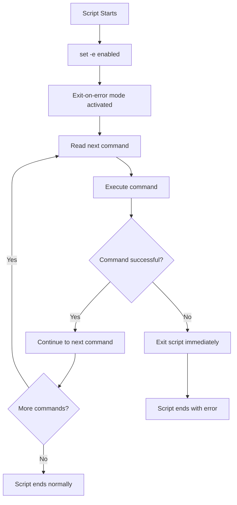
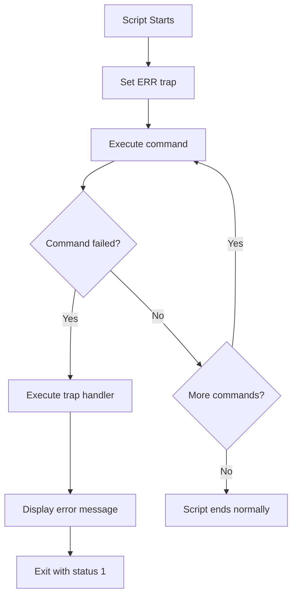

# Error Handling in Shell Scripting

Error handling is crucial in shell scripting to ensure smooth execution and better debugging. Below are various ways to handle errors effectively.

## 1. Exit Status ($?)
- Every command in Linux returns an exit status (0 for success, non-zero for failure). 
- You can check the exit status using `$?`.

### Example:
```bash
#!/bin/bash

mkdir /root/testdir  # Trying to create a directory in a restricted location
echo "Exit Status: $?"  # Check the exit status (0 = success, non-zero = failure)
```

💡 **Best Practice**: Use exit status checks to handle errors.

```bash
#!/bin/bash

mkdir /root/testdir
if [[ $? -ne 0 ]]; then
    echo "Error: Failed to create directory!"
    exit 1  # Exit script with error
fi
```

## 2. Using `set -e` (Exit on Error)
`set -e` makes the script exit immediately if any command fails.

```bash
#!/bin/bash
set -e  # Exit on error

mkdir /root/testdir  # This will cause the script to exit if it fails
echo "This will not execute if mkdir fails!"
```

⚠️ **Be cautious**: This might terminate the script abruptly if you don’t handle errors properly.



## 3. Using `trap` for Error Handling
`trap` allows custom error handling before the script exits.

```bash
#!/bin/bash
trap 'echo "An error occurred! Exiting..."; exit 1' ERR

mkdir /root/testdir  # If this fails, the trap executes
echo "This will not run if an error occurs!"
```


### Custom cleanup using `trap`
```bash
#!/bin/bash
trap 'echo "Cleaning up..."; rm -rf /tmp/tempfile; exit 1' ERR

touch /tmp/tempfile  # Temporary file
mkdir /root/testdir  # Fails, triggering the trap
```

## 4. Using `||` (OR) for Error Handling
The `||` operator allows fallback commands if the first one fails.

```bash
#!/bin/bash

mkdir /root/testdir || echo "Error: Cannot create directory!"
```

## 5. Using `&&` (AND) to Ensure Success Before Execution
The `&&` operator only runs the second command if the first succeeds.

```bash
#!/bin/bash

mkdir /tmp/mydir && echo "Directory created successfully!"
```

## 6. Using `if` Condition for Error Handling
Using `if` to check command success/failure.

```bash
#!/bin/bash

if mkdir /root/testdir; then
    echo "Directory created successfully!"
else
    echo "Error: Cannot create directory!"
    exit 1
fi
```

## 7. Redirecting Error Messages
Redirect errors to a file for logging.

```bash
#!/bin/bash

mkdir /root/testdir 2>> error.log
echo "Check error.log for details!"
```

## 8. Handling Errors in Loops
Break or continue on errors in loops.

```bash
#!/bin/bash

for dir in /root/testdir /tmp/testdir; do
    mkdir "$dir" || { echo "Failed to create $dir, skipping..."; continue; }
    echo "$dir created!"
done
```

## 9. Debugging with `set -x`
`set -x` prints each command before execution for debugging.

```bash
#!/bin/bash
set -x  # Enable debugging

mkdir /root/testdir
echo "Debugging enabled!"
```

### Disable debugging with `set +x`:
```bash
set +x  # Disable debugging
```

## 10. Using `exit` to Terminate on Errors
Use `exit` with an error code (non-zero) to terminate script execution.

```bash
#!/bin/bash

mkdir /root/testdir || { echo "Error: Cannot create directory!"; exit 1; }
```

## 📌 Best Practices for Shell Script Error Handling

✅ Always check exit codes (`$?`)

✅ Use `set -e` for critical scripts

✅ Use `trap` to handle unexpected failures

✅ Log errors using `2>> logfile.log`

✅ Use `||` to execute fallback commands

✅ Use `set -x` for debugging complex scripts


Would you like a real-world example or help debugging a specific script? 🚀

