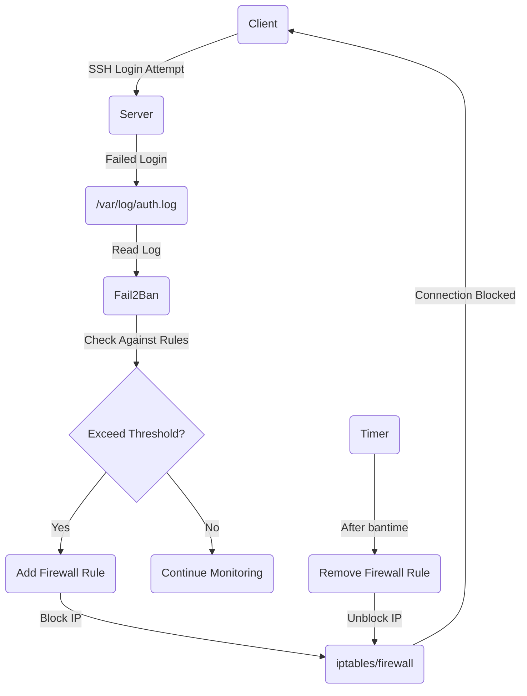
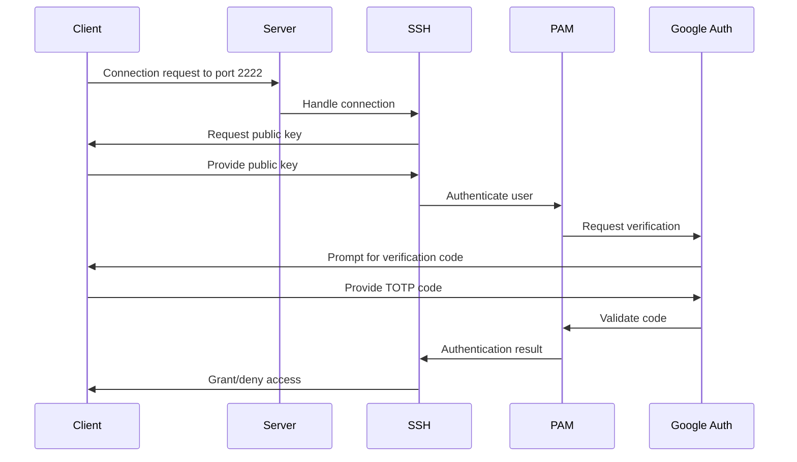

# SSH Hardening: Key-based Authentication, sshd_config, Fail2Ban, and 2FA using Google Authenticator

## 📚 Training Material for Final-Year Engineering Students

**AWS Environment Details:**
* AMI: Ubuntu 22.04 LTS
* Instance Type: t2.micro (or any available free tier)
* Login User: ubuntu

---

## 📋 Table of Contents
1. [Introduction to SSH Hardening](#introduction-to-ssh-hardening)
2. [Setting Up AWS EC2 Instance](#setting-up-aws-ec2-instance)
3. [Key-based Authentication](#key-based-authentication)
4. [Hardening SSH Configuration](#hardening-ssh-configuration)
5. [Setting Up Fail2Ban](#setting-up-fail2ban)
6. [Implementing Two-Factor Authentication](#implementing-two-factor-authentication)
7. [Testing Your Hardened SSH Configuration](#testing-your-hardened-ssh-configuration)
8. [Final Security Checklist](#final-security-checklist)

---

## Introduction to SSH Hardening

### ✅ What It Is
SSH (Secure Shell) is a cryptographic network protocol used for secure remote system administration and file transfers. SSH hardening is the process of strengthening SSH configurations to enhance security and protect against unauthorized access, brute force attacks, and other security threats.

### 🚀 Why It Matters
- SSH is often the primary entry point to servers
- Default SSH configurations can be vulnerable to various attacks
- Properly hardened SSH can prevent most common attack vectors
- A single compromised server can lead to lateral movement across your infrastructure

SSH hardening is not just a good practice; it's essential for any server exposed to the internet.

---

## Setting Up AWS EC2 Instance

### ✅ What It Is
Amazon EC2 (Elastic Compute Cloud) provides scalable computing capacity in the AWS cloud. We'll use an EC2 instance as our server to practice SSH hardening techniques.

### 🚀 Why It Matters
Cloud servers are common targets for attackers due to their public accessibility. Proper setup of security groups and network settings is the first line of defense.

### 🛠️ Step-by-step Implementation

#### 1. Launch an EC2 Instance

1. Log in to the AWS Management Console
2. Navigate to EC2 Dashboard and click "Launch Instance"
3. Name your instance (e.g., "SSH-Hardening-Practice")
4. Select "Ubuntu" for the AMI (specifically Ubuntu 22.04 LTS)
5. Choose "t2.micro" as the instance type
6. Create a new key pair (e.g., "ssh-hardening-key")
   - Select RSA as the key pair type
   - Select .pem file format
   - Download the key pair file
7. Create a new security group with the following inbound rule:
   - Type: SSH
   - Protocol: TCP
   - Port Range: 22
   - Source: My IP (this restricts SSH access to your current IP address)
8. Configure storage (default 8GB is sufficient)
9. Click "Launch Instance"

#### 2. Set Proper Permissions for Your Key Pair

On your local machine, set appropriate permissions for your key pair file:

```bash
# For macOS/Linux
chmod 400 ~/Downloads/ssh-hardening-key.pem

# For Windows (using Git Bash or similar)
chmod 400 /path/to/ssh-hardening-key.pem
```

#### 3. Connect to Your EC2 Instance

```bash
ssh -i ~/Downloads/ssh-hardening-key.pem ubuntu@your-instance-public-ip
```

### 🔍 Verification & Testing

Verify successful connection to your EC2 instance. You should see the Ubuntu welcome message and have command-line access.

### 📝 Notes or Warnings

- The initial connection is not yet hardened; we'll improve its security throughout this guide
- Keep your .pem key file secure; anyone with this file can access your instance
- EC2 charges apply while your instance is running; remember to stop or terminate it when done

---

## Key-based Authentication

### ✅ What It Is
Key-based authentication uses cryptographic key pairs (public/private keys) instead of passwords for SSH authentication. The private key remains on your local machine, while the public key is stored on the server.

### 🚀 Why It Matters
- Significantly more secure than password authentication
- Resistant to brute force attacks
- No password to forget or share
- Can be combined with other security measures for defense in depth

### 🛠️ Step-by-step Implementation

#### 1. Create a Regular (Non-Root) User

First, let's create a regular user that we'll use instead of the default `ubuntu` user:

```bash
# Create a new user (replace 'student' with your preferred username)
sudo adduser student

# Add user to sudo group for administrative privileges
sudo usermod -aG sudo student

# Switch to the new user
sudo su - student

# Create .ssh directory with proper permissions
mkdir -p ~/.ssh
chmod 700 ~/.ssh
touch ~/.ssh/authorized_keys
chmod 600 ~/.ssh/authorized_keys
```

#### 2. Generate SSH Key Pair on Your Local Machine

On your local machine (not the EC2 instance), generate a new SSH key pair:

```bash
ssh-keygen -t ed25519 -f ~/.ssh/aws-ssh-hardening -C "student@ssh-hardening"
```

This will create:
- Private key: `~/.ssh/aws-ssh-hardening`
- Public key: `~/.ssh/aws-ssh-hardening.pub`

#### 3. Upload Public Key to Server

Now, copy the public key content to your server's authorized_keys file:

```bash
# On your local machine, display your public key
cat ~/.ssh/aws-ssh-hardening.pub
```

Copy the output, then on the EC2 instance (as the student user):

```bash
# Paste the public key into the authorized_keys file
echo "paste-your-public-key-here" >> ~/.ssh/authorized_keys

# Verify the key was added
cat ~/.ssh/authorized_keys
```

Alternatively, use the `ssh-copy-id` command if available:

```bash
ssh-copy-id -i ~/.ssh/aws-ssh-hardening.pub student@your-instance-public-ip
```

### 🔍 Verification & Testing

Test the key-based authentication by opening a new terminal and connecting with your new key:

```bash
ssh -i ~/.ssh/aws-ssh-hardening student@your-instance-public-ip
```

You should connect successfully without being prompted for a password.

### 📝 Notes or Warnings

- Store your private key securely; anyone with this key can access your server
- Consider using a passphrase when generating your key for additional security
- The key generation process shown uses ED25519, which is more secure than older RSA-based keys


---

## Hardening SSH Configuration

### ✅ What It Is
SSH configuration hardening involves modifying the SSH daemon settings to enhance security by disabling unnecessary features, limiting access, and enforcing stronger security policies.

### 🚀 Why It Matters
- Default SSH settings prioritize compatibility over security
- Proper configuration can prevent many common attack vectors
- Restricting access methods reduces the attack surface
- Each hardening measure adds a layer of security

### 🛠️ Step-by-step Implementation

#### 1. Backup the Original SSH Configuration

Before making changes, create a backup of the original configuration:

```bash
sudo cp /etc/ssh/sshd_config /etc/ssh/sshd_config.backup
```

#### 2. Edit the SSH Configuration File

Open the SSH daemon configuration file:

```bash
sudo nano /etc/ssh/sshd_config
```

#### 3. Apply Security Hardening Configurations

Make the following changes to the configuration file. Look for existing lines and modify them, or add new lines if they don't exist:

```bash
# Disable root login
PermitRootLogin no

# Disable password authentication
PasswordAuthentication no
ChallengeResponseAuthentication no
UsePAM yes

# Allow public key authentication
PubkeyAuthentication yes

# Change default SSH port (example: 2222)
Port 2222

# Limit user access (replace 'student' with your username)
AllowUsers student

# Set idle timeout (disconnect after 10 minutes of inactivity)
ClientAliveInterval 300
ClientAliveCountMax 2

# Use Protocol 2 only
Protocol 2

# Enable verbose logging
LogLevel VERBOSE

# Restrict SSH to IPv4 only (if needed)
AddressFamily inet

# Disable tunneling and port forwarding (if not needed)
AllowTcpForwarding no
X11Forwarding no
```

#### 4. Update EC2 Security Group for New SSH Port

1. Go to the EC2 Dashboard
2. Click on "Security Groups" in the left menu
3. Select the security group attached to your instance
4. Click "Edit inbound rules"
5. Add a new rule:
   - Type: Custom TCP
   - Protocol: TCP
   - Port range: 2222 (or your chosen port)
   - Source: My IP
6. Keep the existing rule for port 22 until we verify the new port works
7. Click "Save rules"

#### 5. Restart the SSH Service

After making changes, check the configuration for syntax errors and restart the SSH service:

```bash
# Check configuration syntax
sudo sshd -t

# If no errors, restart SSH
sudo systemctl restart sshd
```

### 🔍 Verification & Testing

Open a new terminal and try connecting to the new port:

```bash
ssh -i ~/.ssh/aws-ssh-hardening -p 2222 student@your-instance-public-ip
```

Also test that the security measures are working:

```bash
# Try logging in as root (should fail)
ssh -i ~/.ssh/aws-ssh-hardening -p 2222 root@your-instance-public-ip

# Try logging in with password (should fail)
ssh -p 2222 student@your-instance-public-ip
```

### 📝 Notes or Warnings

- **Important**: Do not close your current SSH session until you've verified you can connect with the new settings
- If you get locked out, you can use the AWS console's EC2 Instance Connect as a backup
- After confirming the new port works, remove the port 22 rule from your security group

---

## Setting Up Fail2Ban

### ✅ What It Is
Fail2Ban is an intrusion prevention tool that monitors log files and temporarily bans IPs that show malicious signs such as too many failed login attempts. It works by creating firewall rules to block IP addresses that exhibit suspicious behavior.

### 🚀 Why It Matters
- Protects against brute force attacks and dictionary attacks
- Reduces server load from sustained attack attempts
- Provides automated response to potential threats
- Customizable to fit specific security needs

### 🛠️ Step-by-step Implementation

#### 1. Install Fail2Ban

```bash
sudo apt update
sudo apt install fail2ban -y
```

#### 2. Create a Fail2Ban Configuration File

Fail2Ban uses the default configuration in `/etc/fail2ban/jail.conf`, but we'll create a local configuration file that won't be overwritten during updates:

```bash
sudo cp /etc/fail2ban/jail.conf /etc/fail2ban/jail.local
sudo nano /etc/fail2ban/jail.d/ssh.local
```

Add the following configuration:

```
[sshd]
enabled = true
port = 2222
filter = sshd
logpath = /var/log/auth.log
maxretry = 3
bantime = 600
findtime = 300
ignoreip = 127.0.0.1/8 ::1
```

This configuration:
- Enables monitoring for SSH on port 2222
- Sets maximum retry attempts to 3 within 300 seconds (5 minutes)
- Sets ban time to 600 seconds (10 minutes)
- Ignores localhost

#### 3. Start and Enable Fail2Ban

```bash
sudo systemctl start fail2ban
sudo systemctl enable fail2ban
```

### 🔍 Verification & Testing

Check Fail2Ban status and configuration:

```bash
# Check if Fail2Ban is running
sudo systemctl status fail2ban

# Check the status of the SSH jail
sudo fail2ban-client status sshd
```

To test Fail2Ban (from a different machine):
1. Try to connect with an incorrect key or password multiple times
2. After 3 failures, your IP should be banned
3. Check the ban status:

```bash
sudo fail2ban-client status sshd
```

### 📝 Notes or Warnings

- Set the `ignoreip` parameter to include your fixed IP addresses to prevent locking yourself out
- Adjust `bantime`, `findtime`, and `maxretry` based on your security requirements
- For production servers, consider increasing the ban time to several hours or days



---

## Implementing Two-Factor Authentication

### ✅ What It Is
Two-Factor Authentication (2FA) adds an additional layer of security by requiring something you know (password or key) and something you have (a time-based one-time password generated on your mobile device).

### 🚀 Why It Matters
- Adds an extra verification layer beyond SSH keys
- Protects against stolen private keys
- Makes unauthorized access significantly more difficult
- Recommended for production systems with sensitive data

### 🛠️ Step-by-step Implementation

#### 1. Install Google Authenticator PAM Module

```bash
sudo apt update
sudo apt install libpam-google-authenticator -y
```

#### 2. Configure Google Authenticator for Your User

Log in as the user who will use 2FA, then run:

```bash
google-authenticator
```

Answer the following prompts:
- Time-based tokens? `y`
- Update .google_authenticator file? `y` 
- Disallow multiple uses? `y`
- Increase time window? `n`
- Rate limiting? `y`

After running this command, you'll see:
- A QR code to scan with the Google Authenticator app
- A secret key for manual entry
- Emergency scratch codes (save these securely)

Scan the QR code with the Google Authenticator app on your smartphone.

#### 3. Configure PAM to Use Google Authenticator

Edit the SSH PAM configuration:

```bash
sudo nano /etc/pam.d/sshd
```

Add the following line at the end of the file:

```
auth required pam_google_authenticator.so
```

#### 4. Configure SSH to Use Challenge-Response Authentication

Edit the SSH configuration:

```bash
sudo nano /etc/ssh/sshd_config
```

Find or add these lines:

```
# Enable challenge-response authentication
ChallengeResponseAuthentication yes

# Make sure this is set to 'no' if using only key-based auth
PasswordAuthentication no

# Enable AuthenticationMethods
AuthenticationMethods publickey,keyboard-interactive
```

#### 5. Restart the SSH Service

```bash
sudo systemctl restart sshd
```

### 🔍 Verification & Testing

Open a new terminal and connect to your server:

```bash
ssh -i ~/.ssh/aws-ssh-hardening -p 2222 student@your-instance-public-ip
```

You should now be prompted for:
1. Your SSH key passphrase (if you set one)
2. A verification code from your Google Authenticator app

Enter the code shown in your Google Authenticator app to complete the login.

### 📝 Notes or Warnings

- Keep your backup/scratch codes in a secure location
- If you lose access to your authenticator app and scratch codes, you'll need to use AWS console access to recover
- Ensure your server and phone clocks are synchronized to avoid authentication issues



---

## Testing Your Hardened SSH Configuration

### ✅ What It Is
Testing your SSH hardening configuration ensures that all security measures are working as expected and helps identify any potential weaknesses or misconfigurations.

### 🚀 Why It Matters
- Verifies that security controls are functioning correctly
- Identifies potential vulnerabilities before attackers do
- Ensures legitimate users can still access the system
- Builds confidence in your security implementation

### 🛠️ Step-by-step Verification

#### 1. Test Basic Connectivity

```bash
# Connect with the correct key, port, and user
ssh -i ~/.ssh/aws-ssh-hardening -p 2222 student@your-instance-public-ip
```

This should prompt for your 2FA code and then connect successfully.

#### 2. Test Security Controls

Try these tests, which should all fail:

```bash
# Attempt to connect to the default port
ssh -i ~/.ssh/aws-ssh-hardening student@your-instance-public-ip

# Attempt to connect as root
ssh -i ~/.ssh/aws-ssh-hardening -p 2222 root@your-instance-public-ip

# Attempt to connect without a key
ssh -p 2222 student@your-instance-public-ip

# Attempt to connect with wrong 2FA code
ssh -i ~/.ssh/aws-ssh-hardening -p 2222 student@your-instance-public-ip
# Enter an incorrect verification code
```

#### 3. Test Fail2Ban

From a different machine or network:

```bash
# Attempt multiple failed logins
ssh -p 2222 student@your-instance-public-ip
# Enter incorrect password multiple times
```

After 3 failed attempts, check if your IP is banned:

```bash
sudo fail2ban-client status sshd
```

#### 4. Check SSH Configuration

Verify your SSH configuration:

```bash
# Check for syntax errors
sudo sshd -t

# View active configuration
sudo sshd -T
```

#### 5. Check Logs for Suspicious Activity

```bash
# View SSH auth logs
sudo grep "sshd" /var/log/auth.log
```

Look for failed login attempts, successful logins, and other SSH-related events.

### 📝 Notes or Warnings

- Run these tests from different machines if possible
- Testing Fail2Ban might temporarily block your access; have a backup access method
- Use AWS EC2 Instance Connect as a last resort if you get locked out

---

## Final Security Checklist

### ✅ SSH Hardening Security Checklist

| Security Measure | Configuration | Implemented | Tested |
|------------------|---------------|------------|--------|
| **EC2 Security Group** | Custom port 2222 only | ☐ | ☐ |
| **Key-based Authentication** | RSA/ED25519 key pair | ☐ | ☐ |
| **Root Login** | `PermitRootLogin no` | ☐ | ☐ |
| **Password Authentication** | `PasswordAuthentication no` | ☐ | ☐ |
| **Custom SSH Port** | `Port 2222` | ☐ | ☐ |
| **User Restrictions** | `AllowUsers student` | ☐ | ☐ |
| **Idle Timeout** | `ClientAliveInterval 300` | ☐ | ☐ |
| **Protocol Version** | `Protocol 2` | ☐ | ☐ |
| **Verbose Logging** | `LogLevel VERBOSE` | ☐ | ☐ |
| **Fail2Ban** | Installed and configured | ☐ | ☐ |
| **2FA Authentication** | Google Authenticator | ☐ | ☐ |
| **Regular User** | `student` with sudo access | ☐ | ☐ |

### 🛡️ Additional Security Recommendations

1. **Regular Updates**:
   ```bash
   sudo apt update && sudo apt upgrade -y
   ```

2. **Monitor Failed Login Attempts**:
   ```bash
   sudo grep "Failed password" /var/log/auth.log
   ```

3. **Configure Automatic Security Updates**:
   ```bash
   sudo apt install unattended-upgrades
   sudo dpkg-reconfigure unattended-upgrades
   ```

4. **Consider Additional Security Tools**:
   - OSSEC - Host-based intrusion detection
   - AWS CloudWatch - Log monitoring and alerting
   - AWS GuardDuty - Threat detection service
   - AWS Systems Manager - Secure remote management

5. **Document Your Configuration**:
   - Keep records of security settings
   - Create a disaster recovery plan
   - Document emergency access procedures

---

## 📚 Summary

Congratulations! You've successfully implemented a comprehensive SSH hardening solution on your AWS EC2 instance. By applying these best practices, you've significantly reduced the attack surface and improved the security posture of your server.

Remember that security is an ongoing process. Regularly update your systems, monitor for suspicious activities, and adjust your security measures as new threats emerge.

This training has covered:
- Setting up AWS EC2 instances with proper security groups
- Implementing key-based authentication
- Hardening SSH configurations
- Installing and configuring Fail2Ban
- Setting up two-factor authentication with Google Authenticator
- Testing and verifying your security measures

These skills are directly applicable to real-world server security and will provide a solid foundation for securing any SSH server you manage in the future.

---

## 📝 Clean-Up Instructions

When you've completed this training, remember to:

1. Terminate your EC2 instance to avoid ongoing charges:
   - Go to the EC2 Dashboard
   - Select your instance
   - Click "Instance State" -> "Terminate Instance"

2. Securely store your documentation for future reference

3. Save your SSH keys if you plan to use them for other servers
